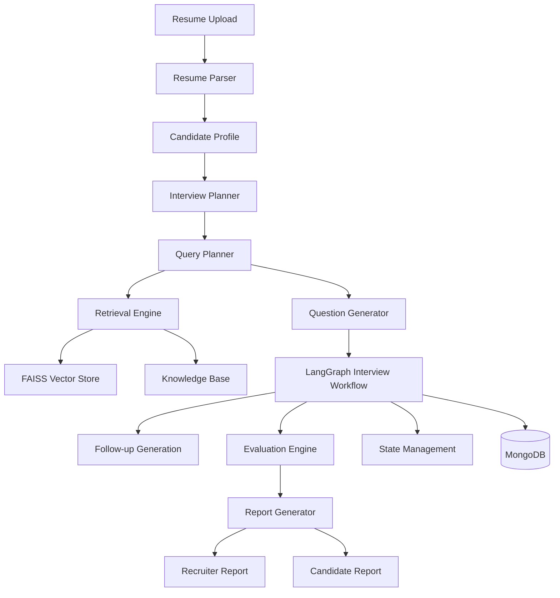
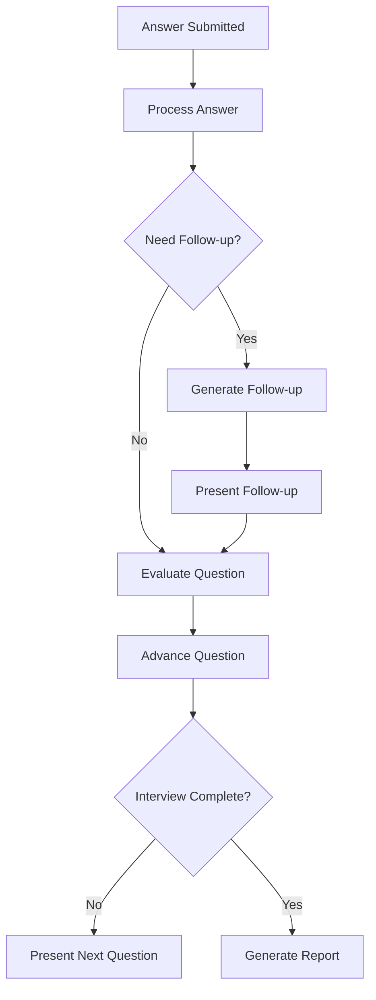

# Adaptive AI Interview System

An AI-powered interview platform that conducts personalized technical interviews using Retrieval-Augmented Generation (RAG), adaptive follow-up questioning, and automated candidate evaluation.

The system analyzes a candidate's resume, generates role-specific interview questions, dynamically adapts based on responses, and produces detailed recruiter and candidate reports.

---

## Overview

Traditional interviews often follow a static question set regardless of a candidate's background, experience, or performance.

This project introduces an intelligent interview workflow that:

* Parses and analyzes resumes
* Builds structured candidate profiles
* Retrieves domain knowledge from a curated knowledge base
* Generates role-specific technical questions
* Produces adaptive follow-up questions
* Evaluates candidate responses
* Generates recruiter and candidate reports

The entire interview lifecycle is orchestrated using LangGraph.

---

## Why This Project?

Recruiters and interviewers often struggle to create consistent, role-specific, and adaptive interviews at scale.

This system addresses that challenge by combining:

* Resume intelligence
* Retrieval-Augmented Generation (RAG)
* Agentic workflows with LangGraph
* Automated evaluation and reporting

The result is a scalable interview platform capable of conducting personalized technical interviews while maintaining consistency and evaluation quality.

---

## System Architecture



---

## LangGraph Interview Workflow



---

## Key Features

### Resume Intelligence

* PDF resume ingestion
* Structured candidate profile extraction
* Skills identification
* Project extraction
* Experience summarization

### Retrieval-Augmented Question Generation

* Knowledge-base-driven interview generation
* Hybrid retrieval architecture
* FAISS vector search
* Query expansion
* Topic-aware retrieval

### Adaptive Interviews

* Dynamic question generation
* Context-aware follow-up questions
* Multi-turn interview flow
* Candidate-specific questioning

### Automated Evaluation

* Conceptual understanding assessment
* Technical depth evaluation
* Completeness scoring
* Communication assessment

### Report Generation

**Recruiter Report**

* Overall score
* Topic-wise scores
* Strengths
* Weaknesses
* Hiring recommendation

**Candidate Report**

* Performance summary
* Areas for improvement
* Learning recommendations

---

## Tech Stack

### Backend

* Python
* FastAPI
* LangGraph
* Pydantic

### LLM Layer

* Groq API

Used for:

* Resume Parsing
* Question Generation
* Follow-up Generation
* Evaluation
* Report Generation

### Retrieval

* FAISS
* Voyage Embeddings
* Hybrid Search
* Query Expansion

### Database

* MongoDB

---

## Project Structure

```text
backend/
│
├── app/
│   ├── api/
│   ├── graph/
│   ├── services/
│   │   ├── interview/
│   │   ├── retrieval/
│   │   ├── resume/
│   │   └── llm/
│   ├── database/
│   ├── models/
│   └── core/
│
├── knowledge_base/
├── scripts/
├── tests/
└── pyproject.toml

frontend/
```

---

## Interview Workflow

### Step 1: Resume Upload

The candidate uploads a resume which is parsed into a structured profile.

### Step 2: Interview Creation

The system:

* Analyzes the candidate profile
* Determines interview focus areas
* Builds an interview plan

### Step 3: Knowledge Retrieval

Relevant topic-specific knowledge is retrieved from the vector database.

### Step 4: Question Generation

Role-specific technical questions are generated using retrieved context.

### Step 5: Adaptive Follow-ups

Follow-up questions are generated dynamically based on candidate responses.

### Step 6: Evaluation

Each response is evaluated on:

* Conceptual Accuracy
* Completeness
* Technical Depth
* Communication

### Step 7: Report Generation

Recruiter and candidate reports are generated automatically.

---

## Example Topics

For a GenAI Engineer role, the system can assess:

* Retrieval-Augmented Generation (RAG)
* Embeddings
* Prompt Engineering
* LLM Evaluation
* Vector Retrieval
* Agentic Workflows
* LangChain
* LangGraph
* Knowledge Retrieval Systems

---

## API Endpoints

### Upload Resume

```http
POST /resume/upload
```

### Create Interview

```http
POST /interviews/create
```

### Submit Answer

```http
POST /interviews/{interview_id}/answer
```

### Get Current Question

```http
GET /interviews/{interview_id}/current-question
```

### Get Interview Report

```http
GET /interviews/{interview_id}/report
```

---

## Setup

```bash
git clone <repository-url>

cd backend

uv sync

uv run uvicorn app.main:app --reload
```

Create a `.env` file and configure:

```env
GROQ_API_KEY=your_key
MONGODB_URI=your_uri
VOYAGE_API_KEY=your_key
```

---

## Future Improvements

* Voice-based interviews
* Real-time interviewer avatar
* WebSocket streaming
* Multi-language interviews
* Advanced scoring calibration
* Interview analytics dashboard
* Human-in-the-loop evaluation
* Support for multiple job families

---

## Results

The platform successfully supports:

* End-to-end interview generation
* Adaptive follow-up questioning
* Retrieval-grounded evaluation
* Automated recruiter reports
* Candidate feedback generation

This project demonstrates how modern LLM orchestration, retrieval systems, and agentic workflows can be combined to build intelligent and scalable interview systems.
